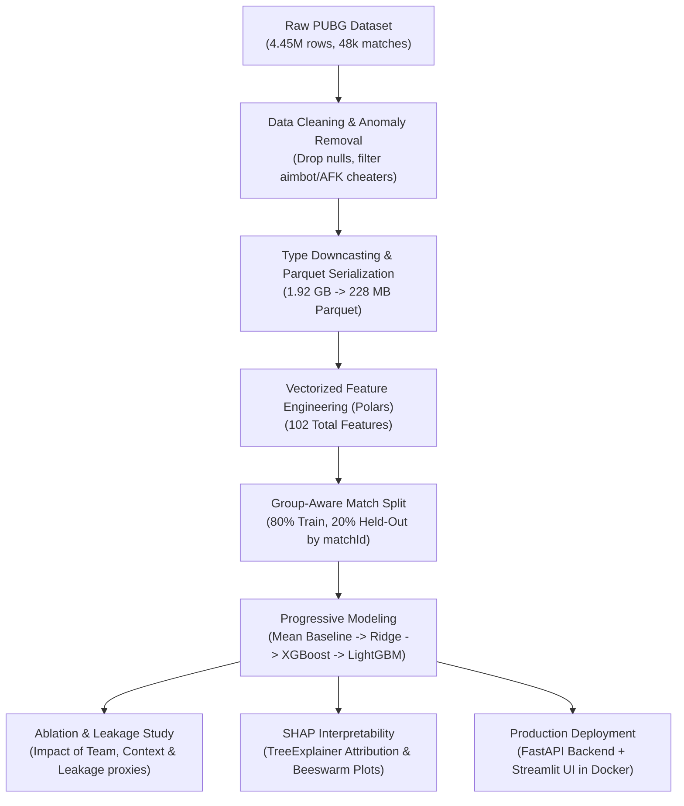

# 🎯 Battle Royale Match Placement Prediction & Post-Match Analytics

[](https://www.python.org/)
[](https://lightgbm.readthedocs.io/)
[](https://fastapi.tiangolo.com/)
[](https://streamlit.io/)
[](https://www.docker.com/)
[](https://docs.pytest.org/)

An end-to-end machine learning system that estimates a player's final placement percentile (`winPlacePerc`) in PUBG matches from post-game behavioral statistics and explains which tactical factors most strongly drive competitive outcomes.

---

## 📌 Framing & Problem Statement

In multiplayer battle royales, in-game stats (kills, damage dealt, distance covered, boosts consumed) reflect complex team coordination, zone navigation, and individual performance. 

> **Important Framing:** This model is designed as a **post-match performance analysis and coaching tool**, **not** a pre-match predictor. Survival-linked statistics like `walkDistance` and `weaponsAcquired` are inherently consequences of surviving longer into later circles. Acknowledging this causal structure prevents false predictive claims while allowing players to quantify the marginal value of positioning, weapon efficiency, and team synergy.

---

## 🏗️ Architecture & Pipeline



---

## 📊 Dataset Profile & Anomaly Filtering

- **Source:** Kaggle PUBG Finish Placement Prediction benchmark (4,446,966 records across 47,965 matches).
- **Target:** `winPlacePerc` $\in [0.0, 1.0]$ (percentile rank within match).
- **Data Hygiene & Cheater Filtering:**
  - Dropped 1 record with missing `winPlacePerc`.
  - Filtered **1,725 anomalous/cheater rows** based on domain heuristics:
    - Players with kills $> 0$ but 0 total travel distance (AFK bot farmers or teleport hacks).
    - Blatant aimbotters: $\ge 10$ kills with 100% headshot rate.
    - Impossible sniper kills: `longestKill` $> 1,000$ meters.
    - Extreme weapon hoarders: `weaponsAcquired` $> 50$.

---

## ⚙️ Feature Engineering (4 Distinct Families)

 placement is zero-sum and relative to match participants, raw stats were enriched into 4 groups:

1. **Match-Relative Features (24 features):**
   - Percentile rank of player within match: `(rank - 1) / (players - 1)`.
   - Ratio against match mean and match max for damage, kills, distance, and boosts.
2. **Team Aggregates (36 features):**
   - Teammate mean, max, min, and sum aggregated across `groupId`: `walkDistance_team_mean`, `kills_team_max`, `killPlace_team_min`.
3. **Efficiency Ratios (9 features):**
   - `damage_per_kill`, `headshot_rate`, `kills_per_walkDistance`, `heals_per_walkDistance`, `items_per_walkDistance`, `totalDistance`.
4. **Match Context (4 features):**
   - Match size (`players_in_match`), group count (`groups_in_match`), squad size (`group_size`), and clustered `match_type_group` (solo, duo, squad, custom).

---

## 🧪 Group-Aware Validation & Progressive Benchmarks

Splitting is strictly **group-aware on `matchId`** so that no match appears in both training and test sets, preventing match-level target distribution leakage.

### Held-Out Test Evaluation Results (92,606 Unseen Players)

| Model | Held-out MAE | Held-out RMSE | Improvement vs Mean Baseline |
| :--- | :---: | :---: | :---: |
| **1. Dummy Mean Baseline** | 0.26708 | 0.30676 | Baseline (0.0%) |
| **2. Ridge Linear Regression** | 0.05301 | 0.07332 | **80.1% reduction in MAE** |
| **3. XGBoost Regressor** | 0.03725 | 0.05097 | **86.0% reduction in MAE** |
| **4. LightGBM Regressor (Primary)** | **0.03659** | **0.05057** | **86.3% reduction in MAE** |

### Primary LightGBM Error Breakdown by Match Type & Size

- **Squad Modes:** MAE = `0.03939`
- **Duo Modes:** MAE = `0.03200`
- **Solo Modes:** MAE = `0.03493`
- **Standard Matches (86–100 players):** MAE = `0.03594`
- **Small Matches (<50 players):** MAE = `0.07127`

---

## 🔬 Ablation Studies & Leakage Analysis

To quantify design choices and isolate the impact of circular survival proxies, systematic ablation was conducted on held-out matches:

| Experiment Configuration | Features | Held-Out MAE | MAE Delta vs Full | Key Finding |
| :--- | :---: | :---: | :---: | :--- |
| **1. Full Feature Set** | **96** | **0.03713** | **0.00000** | Full system benchmark |
| **2. Ablation: No Team Aggregates** | 60 | 0.04573 | **+0.00861** | $\sim$23% error spike; proves squad coordination drives individual outcome |
| **3. Ablation: No Match-Relative** | 72 | 0.04388 | **+0.00675** | $\sim$18% error spike; proves relative ranking within match is vital |
| **4. Ablation: No Efficiency Ratios** | 87 | 0.03711 | -0.00001 | Ratios primarily aid linear models and interpretability |
| **5. Baseline: Raw Features Only** | 24 | 0.05833 | **+0.02120** | $\sim$57% higher error without engineered features |
| **6. Leakage Study: No Survival Proxies** | 59 | 0.03780 | **+0.00067** | Stripping `walkDistance`, `boosts`, `heals`, & `weaponsAcquired` leaves model resilient through combat & team stats |

---

## 🔍 Interpretability (SHAP Analysis)

Tree SHAP values were extracted across held-out match records to understand feature importance:

1. **`killPlace_team_max` (SHAP: 0.132)**: The single strongest driver across squad modes. Having teammates maintain high kill ranking buffers individual placement.
2. **`walkDistance_match_rank_perc` (SHAP: 0.041)**: Relative map rotation within the specific match lobby.
3. **`walkDistance_team_mean` (SHAP: 0.036)**: High average squad movement indicates coordinated rotations into safe circles.
4. **`kills_match_rank_perc` (SHAP: 0.031)**: High kill percentile within the match.
5. **`boosts_team_mean` (SHAP: 0.013)**: High boost usage keeps squad movement speed high and mitigates blue-zone tick damage.

Artifacts generated:
- `reports/shap_summary_plot.png`
- `reports/shap_bar_importance.png`
- `reports/shap_feature_importance.csv`

---

## 🚀 Serving & Application Interface

### 1. FastAPI Inference Service (`app/api.py`)
Run the REST API locally:
```bash
python -m uvicorn app.api:app --reload --port 8000
```
- Interactive Swagger docs at `http://localhost:8000/docs`
- Endpoints:
  - `GET /health`: Health and model readiness check.
  - `POST /predict`: Takes player stats, computes real-time ratios, returns placement percentile and positive/negative behavioral factors.

### 2. Streamlit Web Dashboard (`app/streamlit_app.py`)
Launch the interactive web UI:
```bash
python -m streamlit run app/streamlit_app.py
```
Includes:
- **Preset playstyle templates:** Aggressive Rusher, Tactical Camper, Balanced MVP, Early Drop Casualty.
- **Interactive sliders** for movement, combat, and tactical items.
- **Placement percentile gauge & tier badge.**
- **Tactical coaching feedback.**

---

## 🐳 Docker Deployment

Run both services together with Docker Compose:
```bash
docker-compose up --build
```
- API will be live on `http://localhost:8000`
- Streamlit UI will be live on `http://localhost:8501`

---

## 🧪 Testing

Execute the test suite with pytest:
```bash
python -m pytest tests/test_pipeline.py -v
```
Covers:
- Outlier and hacker heuristic filtering
- Polars feature transformations and dimension checks
- Prediction bounding $[0.0, 1.0]$
- FastAPI test client endpoint integration

---

## 🔮 Limitations & Future Work

1. **Target Inherent Causality:** As documented in our leakage analysis, stats like walk distance are partly consequences of survival. Future work could isolate early-game stats (e.g. first 5 minutes) if time-series telemetry becomes available.
2. **Frontend Modernization:** Transition Streamlit dashboard into a production React / Next.js frontend with Tailwind and WebSockets.
3. **MLOps & Monitoring:** Add Evidently AI for data and concept drift detection, tracking changes across match patches and game updates.
